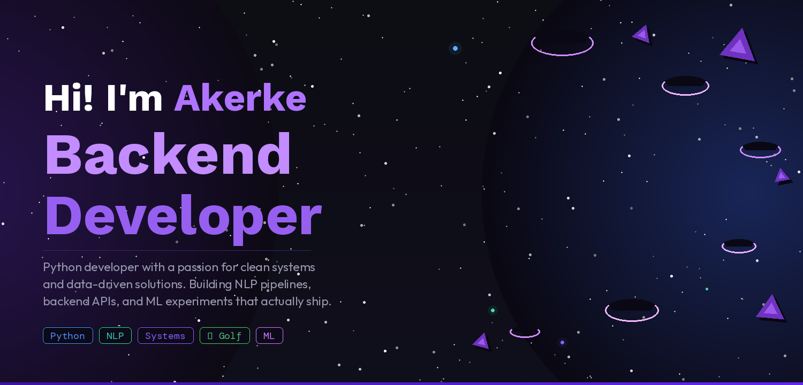

<!-- HERO BANNER -->

  

&nbsp;

&nbsp;

---

### 👩‍💻 About Me

Building backend systems and data pipelines that actually work in the real world.  
I care about clean architecture, meaningful data, and writing Python that doesn't make future-me cry.

- 🔧 &nbsp; Focused on **backend engineering** and **ML pipelines**
- 🌱 &nbsp; Exploring NLP, text classification, and data-driven systems
- 🤝 &nbsp; Open to backend & data internships and collaborative projects
- ⛳ &nbsp; Avid golfer — same philosophy applies: fewer strokes, cleaner code

---

## 🛠 Tech Stack & Tools

<table>
  <tr>
    <td valign="top" width="33%">

**⚡ Languages**

  </td>
  <td valign="top" width="33%">

**🗄 Databases**

  </td>
  <td valign="top" width="33%">

**☁️ Tools & Infra**

  </td>
  </tr>
  <tr>
  <td valign="top" width="33%">

**🧩 Frameworks**

  </td>
  <td valign="top" width="33%">

**🤖 ML & Data**

  </td>
  <td valign="top" width="33%">

**🔗 APIs & More**

  </td>
  </tr>
</table>

---

## 🚀 Featured Projects

<table>
  <tr>
    <td width="50%" valign="top">
      <h3>🚌 Transport Complaints Classifier</h3>
      
NLP pipeline that classifies public transport complaints from raw, noisy text into structured, actionable categories. Built end-to-end in Python.

      

        
        
        
      

      <a href="https://github.com/akassymbekova/transport-complaints-classifier"><b>→ View Project</b></a>
    </td>
    <td width="50%" valign="top">
      <h3>🗄 Final Project — NoSQL</h3>
      
Full-stack web application exploring document-oriented data modeling and dynamic server-side rendering with a MongoDB backend.

      

        
        
        
      

      <a href="https://github.com/akassymbekova/FinalProjectNoSQL"><b>→ View Project</b></a>
    </td>
  </tr>
  <tr>
    <td width="50%" valign="top">
      <h3>⚙️ AS3 Backend</h3>
      
Backend system built with EJS focused on server-side architecture, routing, and clean separation of concerns.

      

        
        
      

      <a href="https://github.com/akassymbekova/AS3backend"><b>→ View Project</b></a>
    </td>
    <td width="50%" valign="top">
      <h3>📂 Explore More</h3>
      
Check out my pinned repositories for additional projects including data experiments, ML notebooks, and backend systems.

       
      <a href="https://github.com/akassymbekova?tab=repositories"><b>→ All Repositories</b></a>
    </td>
  </tr>
</table>

---

## 📊 GitHub Stats

  
  &nbsp;
  

  

---

## 🤝 Connect With Me

---

  <i>"Good code, like a good golf swing — simple, deliberate, effective." ⛳</i>

